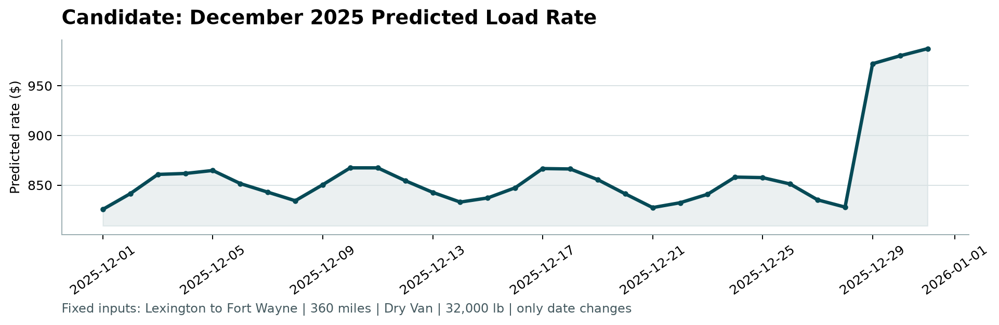

# Spotter Freight-Rate ML Assessment

## Executive summary

The final assessment submission uses a direct-target Ridge model with
`alpha=10`, trained on all 48,000 labeled loads from 2025-01-01 through
2025-10-31. It generates 12,000 validation predictions aligned explicitly to
the employer template by `load_id`. Ridge was selected because it achieved the
best four-fold rolling MAE ($152.17), best worst-fold MAE ($174.05), best mean
RMSE ($633.64), and lowest MAE variability ($14.77) among evaluated candidates.

A separate December-compatible CatBoost model generates the required 31-day
fixed-lane chart. It uses 100 iterations, depth 8, learning rate 0.10, L2 3,
RMSE loss, seed 42, and CPU execution. Its inputs exclude coordinates,
`market_index`, `quote_signal`, and route features because those fields are not
present in the December contract. This model reduced compatible rolling MAE
from $203.59 for Ridge to $167.72.

Both final CSVs pass the unchanged employer scorer and all 19 repository tests.
No hidden validation target was available or used.

## Problem and data understanding

The task is to estimate `posted_rate` for unseen freight loads and to produce a
December daily price curve for a fixed Lexington-to-Fort Wayne Dry Van lane.
The labeled data contains 48,000 January-October rows. Assessment validation
contains 12,000 November-December rows. The fixed chart input contains 31 rows,
one for every date in December.

Core inputs include origin/destination cities and coordinates, distance,
equipment, weight, date, `market_index`, and `quote_signal`. Data-quality work
validated schemas, row counts, identifier uniqueness, date coverage, missing
values, numeric coercion, duplicates, categorical cardinality, outliers, and
train-to-validation shifts. The original employer files remain byte-identical
to their recorded SHA-256 hashes.

The target is strongly right-skewed with rare expensive loads. This makes MAE a
useful primary measure for normal business error, while RMSE and tail slices are
necessary to expose large misses. Distance-normalized pricing and equipment
effects provide strong baseline structure.

## Leakage-safe preprocessing

`load_id` and `posted_rate` are prohibited predictive features. Dates are
expanded deterministically into month, weekday, day-of-month, day-of-year, ISO
week, weekend, and elapsed-day features. Ridge preprocessing remains inside the
fitted pipeline: numeric median imputation, missing indicators, scaling,
constant categorical imputation, and unknown-safe one-hot encoding.

CatBoost receives target-free engineered inputs and native categorical columns.
The December policy includes distance, weight, `weight_per_mile`, date features,
pickup, delivery, and equipment only. Missing values are retained and handled;
no rows are dropped.

## Validation strategy

Random splitting was rejected because the production period follows the
labeled period. Four chronological expanding windows were used:

| Fold | Training period | Validation period | Train rows | Validation rows |
|---|---|---|---:|---:|
| July | Jan-Jun | July | 28,806 | 4,912 |
| August | Jan-Jul | August | 33,718 | 4,759 |
| September | Jan-Aug | September | 38,477 | 4,670 |
| October | Jan-Sep | October | 43,147 | 4,853 |

Each fold fits preprocessing and model parameters on training rows only. Model
selection prioritized rolling mean MAE, then worst-fold MAE, stability, October
performance, RMSE, WMAPE, and operational compatibility.

## Baseline and advanced results

| Model / policy | Mean MAE | SD MAE | Worst MAE | October MAE | Mean RMSE | Mean WMAPE |
|---|---:|---:|---:|---:|---:|---:|
| Ridge full | **152.17** | **14.77** | **174.05** | 143.47 | **633.64** | **6.379%** |
| CatBoost market-only | 153.47 | 32.21 | 201.27 | 141.45 | 638.03 | 6.429% |
| CatBoost full | 158.44 | 39.39 | 215.15 | **134.52** | 640.78 | 6.639% |
| CatBoost no-signal | 161.16 | 36.61 | 213.63 | 149.13 | 638.30 | 6.753% |
| CatBoost December-compatible | 167.72 | 42.96 | 228.44 | 144.68 | 643.34 | 7.029% |
| Ridge December-compatible | 203.59 | 37.13 | 251.44 | 170.63 | 642.63 | 8.549% |

CatBoost improved October and important tail slices, but no advanced main
candidate beat Ridge on the declared rolling ranking. Market-only CatBoost was
only $1.30 worse in mean MAE but had more than twice Ridge's fold variability
and a $27.22 worse worst fold. Selecting it on October alone would overfit the
selection process.

For December, compatible CatBoost improved mean MAE by $35.87 (17.6%) over
compatible Ridge and did not require fabricated future signals. The separate
model is therefore evidence-based rather than a workaround.

## Error analysis and robustness

Ridge's October MAE was $143.47, but top-10% loads had MAE $595.98 and
>2,000-mile loads had MAE $284.09. Reefer MAE ($173.13) exceeded Dry Van
($133.24) and Flatbed ($135.62). The principal residual risk is severe
underprediction of rare expensive loads, which also explains RMSE remaining
above $630 despite much lower typical absolute error.

All evaluated pipelines accept unseen categories. A deterministic synthetic
city holdout removed five frequent cities entirely from training; CatBoost
market-only achieved MAE $121.85, versus $138.52 for Ridge. This is useful
robustness evidence but not a substitute for temporal validation. The final set
contains eight new cities and 1,461 unseen routes, more exposure than the
labeled time folds.

`market_index` is robustly useful within the historical range, but its
provenance and future availability are unconfirmed. It remains in the main
Ridge because validation supplies it and the temporal evidence supports it. It
is excluded from December because inventing missing market inputs would be less
defensible than using a separately validated compatible model.

## Final models and prediction sanity

The full-data Ridge validation predictions range from $33.61 to $6,590.50,
with mean $2,422.00 and median $2,085.55. The labeled target mean is $2,373.98
and median is $2,030.76. Predicted rates rise coherently by distance band and
are highest on average for Reefer loads. November and December assessment
means are close ($2,418.76 and $2,425.06). No raw predictions were nonpositive,
so the documented $0.000001 safety floor changed zero values.

The fixed-lane December predictions range from $825.57 to $987.35, with mean
$860.72 and median $851.14. The first five values are $825.57, $841.42,
$860.76, $861.71, and $864.73. The final three values rise to $972.20, $980.19,
and $987.35. This year-end step is driven by extrapolated calendar features in
a compact model; it should not be interpreted as causal evidence of a specific
market event.

## Final artifacts and quality controls

- `validation_predictions.csv`: 12,000 rows, exact two-column order, unique
  template IDs, positive finite rates, explicit one-to-one ID alignment.
- `outputs/december_chart_predictions.csv`: 31 dates and the original seven
  columns in order; all six fixed input columns are unchanged.
- `models/final_ridge.joblib` and `models/final_december_catboost.cbm`: fitted
  artifacts for deterministic inference.
- `reports/final_model_metadata.json`: parameters, package versions, hashes,
  row counts, ranges, and floor diagnostics.
- `reports/final_prediction_summary.json`: overall, equipment, distance,
  month, market-index, training-target, and December summaries.
- `scorer_results/candidate_december.png`: generated by the unchanged scorer.

All 19 tests pass, including strict schema contracts, source counts, feature
exclusion, unseen-category handling, positivity, template-order equality,
preserved December inputs, and inference reruns from both saved models. The
employer scorer reports: 12,000 final predictions validated, 31 fixed December
predictions validated, and chart created. Final assessment metrics are computed
by Spotter after submission.

## Limitations and conclusion

The official hidden metric is unknown, and no honest estimate is available for
the exact final mix of unseen cities and routes. Rare expensive loads remain
compressed. Compact CatBoost tuning was intentionally CPU-bounded, though a
focused 350-tree refinement performed worse. Market signals remain operational
dependencies for the main model.

Within those constraints, the locked solution follows the strongest available
evidence: stable full-feature Ridge for the supplied assessment feature
contract, and separately validated signal-free CatBoost for the December
contract. Outputs are scorer-valid, reproducible, and fully documented.

